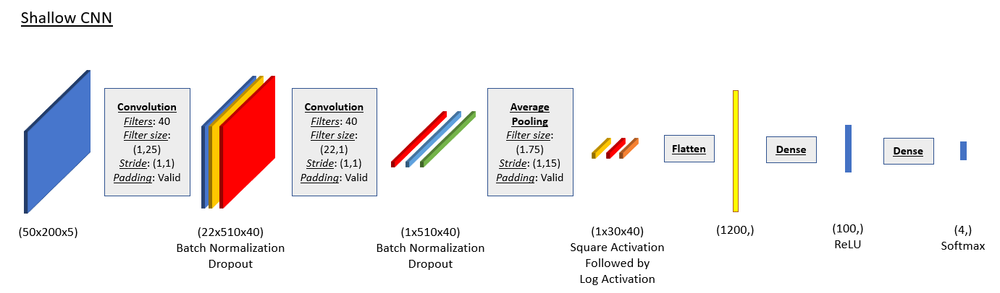
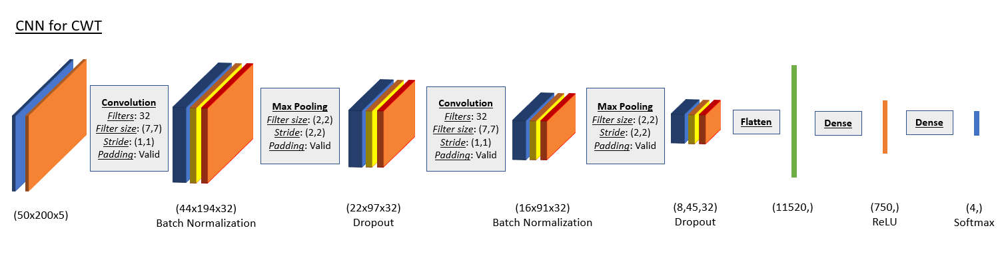

# ECE-C247 Final Project

## Project description 

This project was developed for credit as part of UCLA's EE C247: Neural Networks and Deep Learning course. The project was intended to give students experience working on neural networks in a research application, as well as experience working with some of the topics covered in the last three weeks of class. A major evaluation metric for the project was to develop at least one of the algorithms we discussed 'post-CNNs' or neural network topics we didn’t explicitly get to cover in class. 

The base project provided was to explore datasets collected from electroencephalography (EEG). The data is obtained from the BCI Competition IV, Data sets 2a. It consists of 22 EEG channels from 9 subjects performing 4 motor-imagery tasks. A more complete description of the data is available here: [BCI Competition 2008 – Graz data set A](http://www.bbci.de/competition/iv/desc_2a.pdf). 

Our work is titled, **"Improving motor imagery classification using generative models and artificial EEG signals"**. 

The primary goals were: 

1. Construct artifical EEG data using two neural network models:  
  i. Generative adverserial networks (GAN)  
  ii. variational autoencoders (VAE).  
2. Examine how artifical EEG data affects motor imagery classification. 

## Code 

All code is written in Python 3.6, and deep learning was enabled using TensorFlow 2.x. To enhance our computing power, we utilized [Google Colab](https://colab.research.google.com/notebooks/intro.ipynb) and their free access to TPUs. This tremendously helped our ability to train models relatively quickly, and so we sincerley thank the Google Colab team for providing their service free of cost!  

## Pre-artificial data classification methods  

### Data pre-processing 

We implemented various data augmentation techniques to observe how traditional classification is affected. These include subsampling, obtaining random crops, obtaining sequential crops, and applying a continuous wavelet transform (CWT). Relevant functions are defined in [data_preprocessing.py](data_preprocessing.py). 

Subsampling and cropping are chosen due to their simplicity and ability to increase dataset size. More specifically, subsampling is possible as the dataset is sampled at 250 Hz, whereas typical EEG brain activity is within the range of 0-15 Hz. Cropping is performed as the dataset includes activity from a 4 second window after a visual cue. Humans typically have a reaction time on the order of 250 ms, and the subject may not perform the activity throughout the entire recorded window. 

CWT is performed as feature extraction method since it is known that brain activity can be divided into frequency bands. It is chosen over other time-frequency analysis methods such as the short-time-Fourier transform (STFT) due to its strong ability to analyze transient signals. We implemented a feature extraction tool primarily because we fear the GAN may not be able to learn what features are important for EEG data.

### CNN architectures

  

  

We implement two architectures: a shallow CNN for standard time-based EEG data, based on Schirrmeister et al. (5), and a more traditional CNN for the time-frequency analyzed EEG data. Due to computational memory and processing time, we limited the number of EEG channels included in the CWT data to 5 channels. We decided on probe locations Fz, C3, Cz, C4 and Pz for maximal scalp coverage.

The shallow CNN can be found in [CNN_classification.ipynb](CNN_classification.ipynb), and the CNN for CWT can be found in [CNN_CWT.ipynb](CNN_CWT.ipynb).    

###  Results 

  

Overall test set accuracy of the Shallow CNN against different data augmentation techniques. Sequential cropping performs the best, while subsampling and random cropping deteriorates the accuracy from the baseline. \*CWT data is evaluated on different CNN due to being an invalid size to the Shallow CNN. This data also uses only 5 EEG channels, as opposed to the given 22 channels.

  
  

Using the cropped sequential data augmentation, we trained and tested the Shallow CNN only on one subject at a time. We can see how the CNN extracts features that generalize nicely to the test set in subjects 0, 1, 6, and 7.

Also presented is a confusion matrix on predicted labels for the Shallow CNN on cropped data across all subjects. Values are normalized to amount of predictions made for each task.

## Generating artificial EEG data 

As aforementioned, we construct two generative models for artificial EEG data production: a variational autoencoder (VAE) \cite{kingma2013autoencoding} and a GAN. The VAE is considered due to its strong ability to learn input data distributions. We expect the model to successfully encode useful features from the raw EEG signal. However, we also suspect it to perform worse at generating artificial data. On the other hand, the GAN is used to due to its excellent ability to recreate input data features. However, if fed raw EEG signals, we fear the GAN will fail to understand what features are important when generating artificial data. To combat this, we feed the GAN input data that has undergone a CWT. 

### GAN

  

We implemented 3 GAN architectures: a [deep convolutional GAN (DCGAN)](model_DCGAN.py), a traditional [Wasserstein GAN](model_WGAN.py) and the reported [Wasserstien GAN with a gradient penalty](model_WGAN-GP.py). All 3 GANs are based on the same generator and discriminator networks, shown in the above figure, and utilized the same input data as the CNN for CWT. The generator utilizes transposed convolutions for upsampling. The only difference between the models was the output activation of the discriminator and implemented loss function. The DCGAN uses a sigmoid output activation and a binary cross-entropy loss function. Both the WGANs use a linear output activation and calculate a Wasserstein distance loss function. The WGAN-GP augments the Wasserstein distance by adding a gradient penalty term. 

All GANs were trainined using data from a single person. We found only the WGAN-GP to be successful. The DCGAN suffered from mode-collapse, whereas the WGAN failed to converge after 500 epochs. 

  

Examples of generated CWT EEG data for all 4 motor imagery tasks are shown above. Each column corresponds to a different EEG channel. A comparison between real input data and generated data shows that the WGAN-GP has learnt features. We note these examples were hand-picked, and that there is a wide variety of signal data.

### VAE 

  

The CNN VAE architecture utilises a convolutional encoder and a transpose convolution shown above. In the convolutional layers, a temporal and spatial convolution is performed to drastically further reduce the parameter size and training time. In the architecture, regularizers that affect the stochasticity of the model such as batchnorm were left out. Empirically, they seemed to have no noticeable affect on the model's diagnosis for mode-collapse. However, in models with more layers it would be crucial for these regularizers to be implemented in an abnormal and strategic way. This final model was used after iterations of different models including multi-layer perceptron (MLP) VAE and a traditional CNN VAE. 

  

Unfortunately, we failed to train our VAE to generate EEG data. An example of a single artificial trial signal is shown aboove. Although the trial looks like a valid EEG signal form, all the probe channels collapse to the same signal, suggesting mode-collapse failure.

### Classification methods with artificial data

  

Using the trained WGAN-GP, we generate 100 artificial CWT EEG signals for each of the 4 tasks, for a total of 400 additional samples in our training data set for subject 6. We show the results when appending the training dataset with various ratios of the total artificial dataset above. 3 trials of training were taken on each augmented dataset with 0\%, 25\%, 50\%, and 100\% of the artificial data appended, for 30 epochs each. For reference, the natural dataset had 1180. The boxplot shows the range, indicated by the length of the vertical line, and the mean of the test accuracies, which is indicated by the horizontal orange line. The box itself represents the cutoff of a quartile from the mean, assuming a normal distribution.

## Conclusions

When augmenting the data using subsampling, we sampled every 5 time bins, causing the number of data trials to be 5 times larger and the time length to be 5 times smaller. Subsampling causes the training and validation data to be highly correlated to each other, making the CNN overfit on the training data. Once the CNN overfits, it will learn the nuances and noise of the training data, features which cause the CNN to perform badly on new data. 

Random cropping also caused the CNN to perform worse on the testing data. This may be because the cropping is not guaranteed to emphasize important time bins. The data augmentation method that improved performance was cropping sequentially, as it gave an 8\% increase in test accuracy after training. An empirical reason why cropping sequentially may work is because the middle portion on the EEG signal will be repeated in all the crops taken of the signal, given that the length of the crop >500 time bins.

The CWT augmentation resulted in a very poor baseline classification accuracy. One explanation for this inferior result is due to poor architecture choice. The CNN for CWT was built upon the approximation that the CWT data can treated like images, which may not necessarily be true. Furthermore, the CNN for CWT was made to be shallow such that it could be compared with the baseline Shallow CNN. We suspect the architecture could be made deeper in order to improve accuracy. Another explanation for the inferior result is the reduced dimensionality of the EEG data when training the CNN for CWT. Due to computational memory and processing time considerations, we chose to reduce the number of EEG channels used in training from 22 channels to 5 channels.  

With regards to artificial data synthesis, the WGAN-GP successfully identifies features present in the real data and generates a variety of artificial data. This results in a significant improvement of the CNN classification when implemented on CWT data. The training accuracy is largest when 25\% of the artificial data is appended to the training set, and worsens for larger and larger ratios. This worsening is expected as the network begins to learn more features from the artificial data that may not be present in the real data. The architecture itself was robust to mode-collapse and convergence failure, which is a common pitfall for most GAN architectures. 

Finally, the VAE suffered from individual examples being mapped to the same random distribution in the latent space. This implies that the decoder ignored the latent variable input and generated an output less arbitrarily. Not identically similar, but in essence, the VAE suffered from mode-collapse. This led to problems including, not being able to create a data set for the CNN to train on. Due to the time constraint, the exact cause of the problem still remains unclear. The leading insight is that the model is too constrictive for individual training examples. 

Overall, we show that it is not only possible to synthesize artificial EEG data, but it is also possible to use this data to improve MIC. For future work, an interesting architecture we suspect may be ideal for artificial EEG data generation is the VAE-GAN. As the name suggests, this model combines the impressive feature encoding ability of the VAE with the strong feature replication ability of the GAN. The implications of our findings are exciting for the broader community utilizing deep learning models for BCIs and MIC. Nevertheless, we remain wary that the ability to generate artificial EEG data may have negative ramifications in the future, such as exposing BCI users to bad actors who could send fake tasks forcing the user to perform unwanted actions. 

## Collaborators

Krish Kabra - [krishk97](https://github.com/krishk97)

Daniel Truong - [danthedolphin](https://github.com/danthedolphin)

Calvin Chang - [LemonCakeXD](https://github.com/LemonCakeXD)
