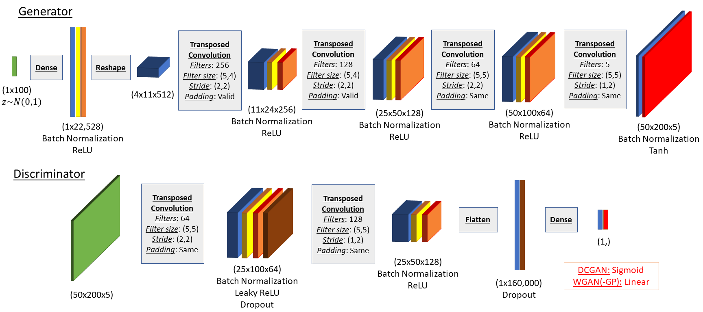
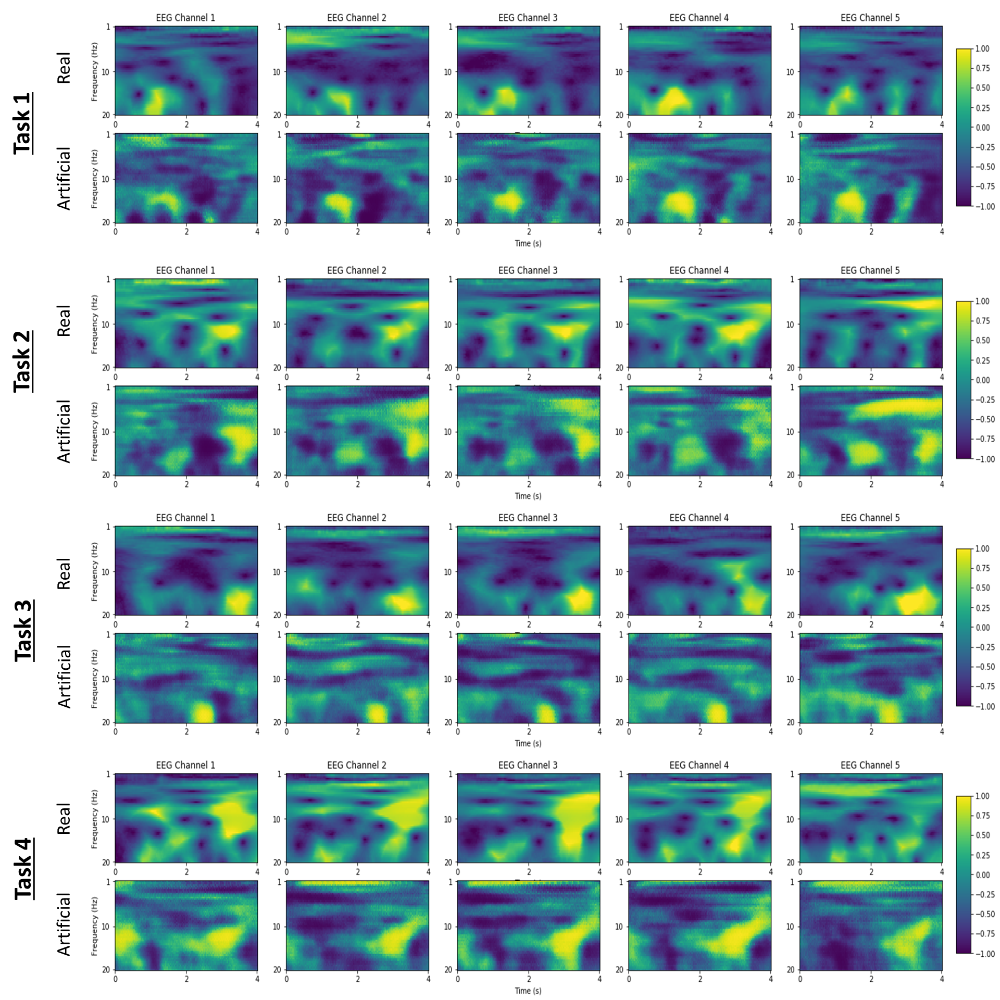
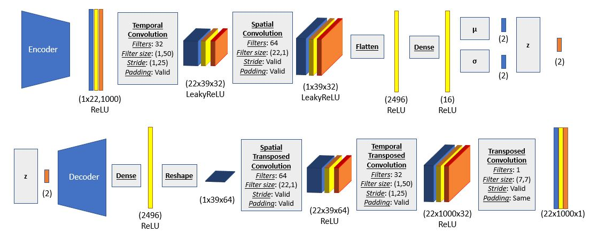
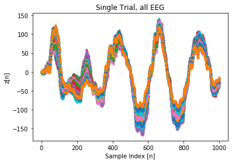
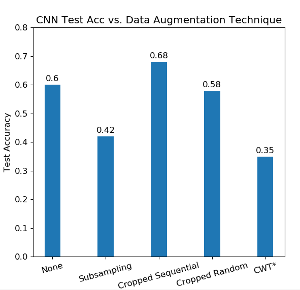
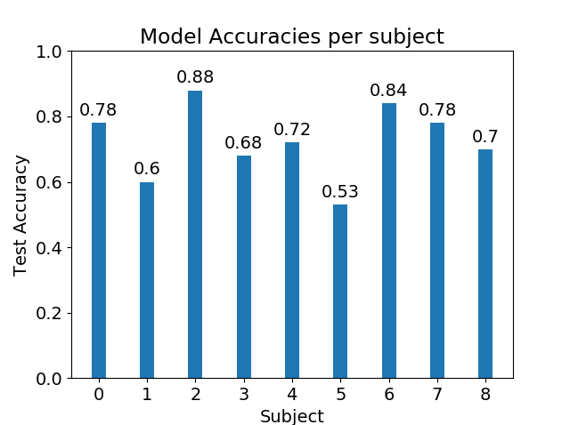
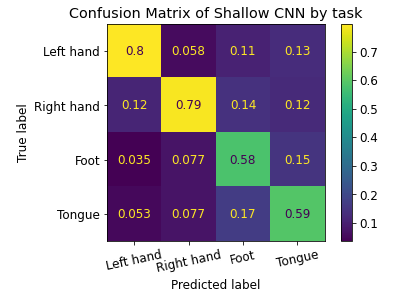
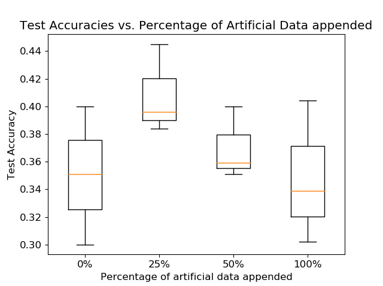

# ECE-C247 Final Project

## Project description 

This project was developed for credit as part of UCLA's EE C247: Neural Networks and Deep Learning course. The project was intended to give students experience working on neural networks in a research application, as well as experience working with some of the topics covered in the last three weeks of class. A major evaluation metric for the project was to develop at least one of the algorithms we discussed 'post-CNNs' or neural network topics we didn’t explicitly get to cover in class. 

The base project provided was to explore datasets collected from electroencephalography (EEG). The data is obtained from the BCI Competition IV, Data sets 2a. It consists of 22 EEG channels from 9 subjects performing 4 motor-imagery tasks. A more complete description of the data is available here: [BCI Competition 2008 – Graz data set A](http://www.bbci.de/competition/iv/desc_2a.pdf). 

Our work is titled, **"Improving motor imagery classification using generative models and artificial EEG signals"**. 

The primary goals were: 

1. Construct artifical EEG data using two neural network models:  
  i. Generative adverserial networks (GAN)  
  ii. variational autoencoders (VAE).  
2. Examine how artifical EEG data affects motor imagery classification. 

## Generating artificial EEG data 

### GAN

  

  

### VAE 

  

  

## Motor imagery classification 

### Pre-artificial data classification methods  

  

  
  

### Classification methods with artificial data

  

## Conclusions

## Collaborators

Krish Kabra - [krishk97](https://github.com/krishk97)

Daniel Truong - [danthedolphin](https://github.com/danthedolphin)

Calvin Chang - [LemonCakeXD](https://github.com/LemonCakeXD)
